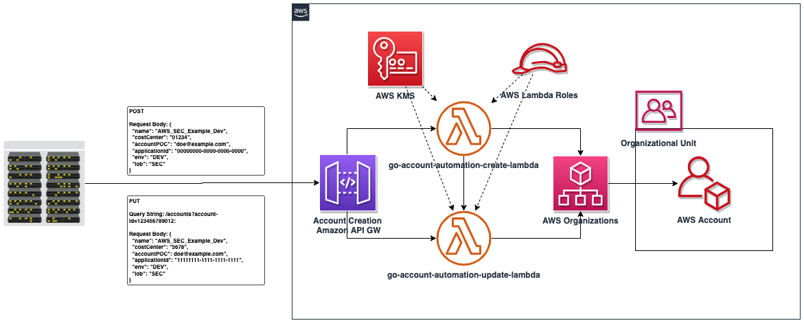
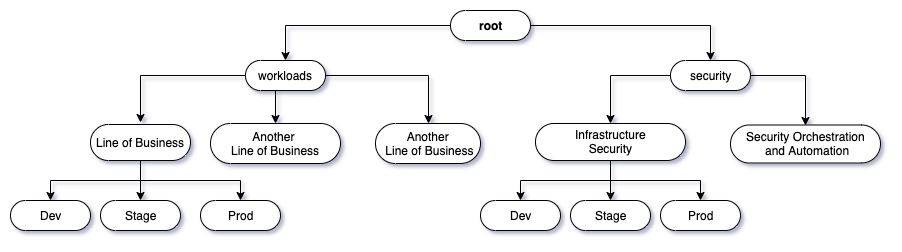

# amazon-apigw-account-creation-automation

This repo provides resources for creating AWS accounts using an Amazon API Gateway and AWS Lambda. If you're trying to automate the way application teams request AWS accounts in your organization, such as a ticketing system, this automation can be utilized by other automation. For instance, if a ticket to request a new AWS account by an application team is created and approved - you can create automation to strip required fields from the ticket and then invoke this Amazon API Gateway with those values in the request to create an account and place it in the correct Workloads OU.

# How it works

The Amazon API Gateway is set up via a [swagger file](modules/json/swagger.json). It utilizes two AWS Lambdas written in Golang that act as request handlers for a POST and PUT method for creating and updating for AWS accounts, respectively.

The caller of the Amazon API Gateway endpoint (Note: consider adding an [API Gateway Lambda Authorizer](https://docs.aws.amazon.com/apigateway/latest/developerguide/apigateway-use-lambda-authorizer.html) and autorization methods by adjusting the swagger.json) will provide required variables to create an account under AWS Organizations.


The automation will also detect if it is running in a non-production (based on the environment variable you provide in Terraform) and if so will not actually create accounts and instead mock the API calls. Once the automation is elevated to prod, the environment variable should be changed to `prod` and the automation will then make non-mocked API calls resulting in actual account creation, tagging, and OU placement.



The logic for placing the account in the correct organizational unit will need to be changed to match your organization's OU structure. 

The current automation logic is for the organizational unit structure depicted in the below diagram where the final destination is a leaf branch which is either a DEV, LAB, TEST, PROD OU under a Workloads->Line of Business or Security->Security Team parent OU. The correct OU is found by querying organizations and parsing the tree under either the Workloads or Security OU is matched based on the LOB and ENV input parameters given to the Amazon API Gateway. 

You can adjust this by updating the go-account-automation-create Lambda and Terraform inputs to match any organizational structure or by simply adjusting the workflow to accept the actual OU ID instead of relying on query logic based on a LOB and ENV variable. This logic was formed as the team requesting an account through the system fronting this automation may not know the OU ID of their line of business and environment they're intending the account to be placed in.




## Terraform Input Variables

These are required inputs to build the needed resources.

| Variable                | type        | Lambda Environment Variable | description |
|------------------------ |-------------|-----------------------------|-------------|
| account_id              | string      | yes                         | AWS account ID these resources are being deployed into. |
| application_id          | string      | yes                         | Application ID to identify resources deployed by this module. |
| create_account_role_arn | string      | yes                         | The role arn in MP (or whichever account that has permission to create other organization accounts) that will be assumed and used to create accounts. |
| email_domain            | string      | yes                         | Email domain used in validation of the account POC email address. |
| region                  | string      | no                          | Region resources are being deployed in. |
| runtime_env             | string      | yes                         | LAB/DEV/TEST/PROD environment this is being deployed to. When elevating to PROD, ensure PROD is passed. |
| infrosec_ous            | map[string] | yes                         | Map of security related OU IDs. |
| workload_ou             | string      | yes                         | Workload (or Application OU) that requesters of new accounts will be having their accounts deployed in. |

The value `create_account_role_arn` is used due to this application potentially not residing in the account that has access to Organizations and thus not able to create or update an account. 

The role that the Lambda roles assume and is used to perform these actions must have these permissions:

```javascript
{
    "Version": "2012-10-17",
    "Statement": [
        {
            "Effect": "Allow",
            "Action": "logs:CreateLogGroup",
            "Resource": "arn:aws:logs:us-east-1:012345678912:*"
        },
        {
            "Effect": "Allow",
            "Action": [
                "organizations:CreateAccount",
                "organizations:DescribeAccount",
                "organizations:DescribeCreateAccountStatus",
                "organizations:ListRoots",
                "organizations:ListOrganizationalUnitsForParent",
                "organizations:MoveAccount",
                "organizations:TagResource",
                "organizations:UntagResource"

            ],
            "Resource": [
                "*"
            ]
        }
    ]
}
```

As well as any trust policy modifications to allow the role to be assumed by the Lambda role.

## Amazon API Gateway Request Field Parameters

For details on the inputs for each of the API methods, view the README.md in each of the `../modules/src/go-account-automation-{create/update}` directories.

Further, input validation occurs on the Amazon API Gateway for these inputs. View the `swagger.json` to view or edit the patterns to your requirements.

## Deploying This Solution
### Updating the Lambdas to handle your organizational logic

Navigate to the sub-directiory `/amazon-apigw-account-creation-go-tf/source/modules/src/go-account-automation-create`.

Inside of Handler.go, review these relevant functions and determine what logic must be altered to place the new accounts into their correct OU based on request parameters:

* RetrieveOUs
* RetrieveInfraSecOUs
* RetrieveParentOU
* RetrieveEnvOU
* DetermineDestinationOU
* HandleRequest
* MoveAccount

One of `MoveAccount` input parameters is the OU ID. So, if you will have that as part of your request parameters it and `HandleRequest` are the only two needed in the above list, for example.

### Building the Go code to zip for Lambda.

Navigate to the the respective directory of each AWS Lambda under `/src/` and refer to the following [AWS documentation on how to build Golang binaries for AWS Lambda](https://docs.aws.amazon.com/lambda/latest/dg/golang-package.html#golang-package-mac-linux). Don't worry about ZIPing or archiving the directory, the Terraform code will do that for you. 

### Deploying the Terraform.

If you have a CI/CD pipeline at your organization for deploying Terraform into AWS accounts, utilize that solution to deploy this application. Otherwise, follow the steps below if you're deploying from your local machine with AWS Credentials:


* Navigate to the root of the directory for this repository
* Edit the locals block to populate all of the fields with their correct, non-default values in main.tf file.
** Note, you can move these to the variables.tf file if you prefer as opposed to the locals.
* Perform the following commands:
** Terraform init
** Terraform plan
** Terraform apply

Make sure to review your plan and ensure your Amazon API Gateway and your AWS Lambdas are deploying as expected. On apply, ensure all resources are created as expected. You can now call your API to create new accounts!

## Security

Consult with your security teams to to ensure you meet the required security controls for securing an API Gateway. For some more documentation on best practices for API Gateway and Lambda, see the below documents:

1. [Add a AWS Lambda Authorizer or Authentication/Authorization to Amazon API Gateway](https://docs.aws.amazon.com/apigateway/latest/developerguide/apigateway-use-lambda-authorizer.html).
2. [Add Access Logging to the Amazon API Gateway](https://docs.aws.amazon.com/apigateway/latest/developerguide/set-up-logging.html).
3. [Add a WAF to the Amazon API Gateway](https://docs.aws.amazon.com/apigateway/latest/developerguide/apigateway-control-access-aws-waf.html).
4. [Add Lambdas to a VPC](https://docs.aws.amazon.com/apigateway/latest/developerguide/apigateway-control-access-aws-waf.html).

## License

This library is licensed under the MIT-0 License. See the LICENSE file.

